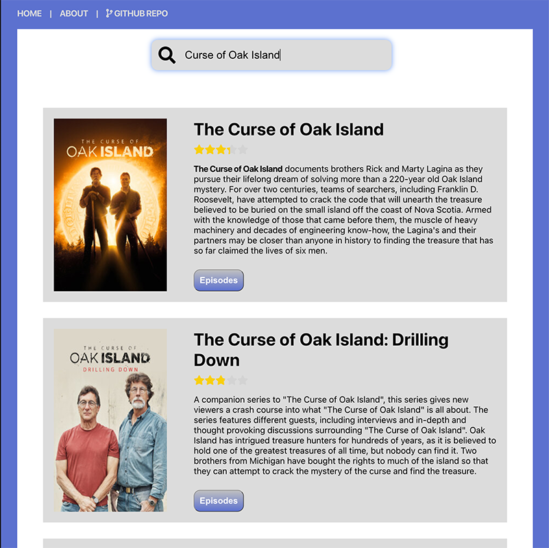
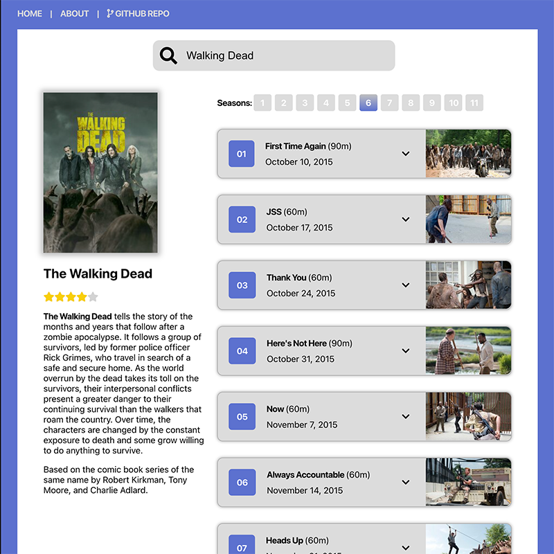

# TV Show Search

<p>
  
  
</p>

[](http://tvhub.jeffolivier.com)

## About This Project

In May 2020, I was furloughed from a car rental company that, like most of the travel industry, was hit hard when Covid-19 brought international travel to a standstill. About two months later, along with 90% of the workforce, I was officially laid off.

I had been coding in PHP and vanilla JavaScript since 1998, and ColdFusion from 2013 up until the layoff. I knew those technologies well, but honestly, I was starting to feel stale. The industry had moved forward and I knew that I had too.

I'd actually had a brief run-in with React just before the furlough — I volunteered to finish an internal dashboard someone had started. The whole "small components" philosophy was a pretty big shift from the large-file approach I was used to, and I was quickly overwhelmed. Then we were furloughed before I had a chance to figure it out.

After the layoff, I started talking to friends who were already working with React, watched some tutorials, and began applying for React developer roles. One of those applications came with a timed coding challenge: use the TVMaze API to build a show search page in React. I didn't do great on it, but instead of letting it go, I decided to finish it properly on my own. This is that project, completed in December 2020.

<p style="display:flex; flex-direction:row; align-items:center; gap:20px;">
<span>

**This app demonstrates the use of:**

- React
- React Router
- Local state management
- Multiple React components
- Passing state and pointers to functions to child components
- Accessing URL parameters
- Responsive CSS Grid
- Modular Sass
- JavaScript ES6
- JavaScript Fetch API with async/await

</span>

</p>

## Installation

```bash
npm install
npm start
```
